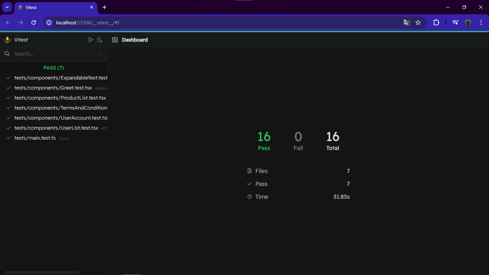

# Automated Testing for React Projects 🚀

Automated testing plays a crucial role in ensuring the quality and reliability of React projects. By automating tests, developers can catch bugs early, streamline workflows, and deliver high-quality code consistently. This README.md file provides an overview of the importance of automated testing, a comparison with other testing types, how it boosts testing for React apps, and the significance of Vitest framework and Testing Library.

## Importance of Automated Testing 💡

Automated testing is essential for modern software development practices. It helps in:

- **Early Bug Detection:** Identifying and fixing bugs during development stages, reducing the cost of bug fixes in production.
- **Consistent Code Quality:** Ensuring that code meets quality standards across different iterations and team members.
- **Regression Testing:** Automating repetitive tests to check for regressions and ensure new changes don't break existing functionalities.



## Comparison with Other Testing Types 🛠️

Compared to manual and semi-automated testing:

- **Efficiency:** Automated testing is faster and more efficient, allowing for quicker feedback during development cycles.
- **Scalability:** It scales easily with large codebases and complex applications, covering a wide range of test scenarios.
- **Reliability:** Automated tests are consistent and reliable, reducing human error and improving test coverage.

## Boosting Testing in React Apps with Automated Testing 🔑 

For React developers, automated testing offers several advantages:

- **Faster Iterations:** Automating tests speeds up development cycles, enabling rapid iteration and deployment.
- **Code Confidence:** Automated tests provide developers with confidence in their code changes, leading to more robust applications.
- **Continuous Integration:** Integrating automated tests into CI/CD pipelines ensures code quality at every stage of development.

## Importance of Vitest Framework and Testing Library 🔍

Frameworks like Vitest and Testing Library are invaluable for automated testing in React projects:

- **Vitest Framework:** Offers a comprehensive suite of testing utilities tailored for React, making it easier to write and maintain tests.
- **Testing Library:** Provides a user-centric testing approach, focusing on simulating user interactions and behaviors for more realistic tests.

## Getting Started for basic react testing

Follow these steps to set up and run Automated Testing for React Projects on your local machine:

1. **Clone the repository:**

   ```
   git clone https://github.com/tayyab-004/Automated-Testing-React.git
   ```

2. **Navigate to the project directory:**

   ```
   cd Automated-Testing-React
   ```

3. **Navigate to the desired project:**

   For basic automated testing:

   ```
   cd basic-automated-testing-react
   ```

4. **Install dependencies:**

   ```
   npm install
   ```

5. **Start the development server:**

   ```
   npm run dev
   ```

6. **To run tests:**

   For automated tests using Jest:

   ```
   npm test
   ```

   OR

   Using npx Jest:

   ```
   npx jest
   ```

## Getting Started for advance react testing

Follow these steps to set up and run Automated Testing for React Projects on your local machine:

1. **Clone the repository:**

   ```
   git clone https://github.com/tayyab-004/Automated-Testing-React.git
   ```

2. **Navigate to the project directory:**

   ```
   cd Automated-Testing-React
   ```

3. **Navigate to the desired project:**

   For basic automated testing:

   ```
   cd advance-automated-testing-react
   ```
4. Create a .env.local File:

   In the root directory of the project, you'll find a sample .env file. Make a copy and save it as .env.local.
   Replace the Auth0 Domain and Client ID with the actual values you obtained from Auth0.

5. **Install dependencies:**

   ```
   npm install
   ```

6. **Start the development server:**

   ```
   npm start
   ```

7. **To run tests:**

   For automated tests using Jest:

   ```
   npm run test:ui
   ```

Happy coding! ☕